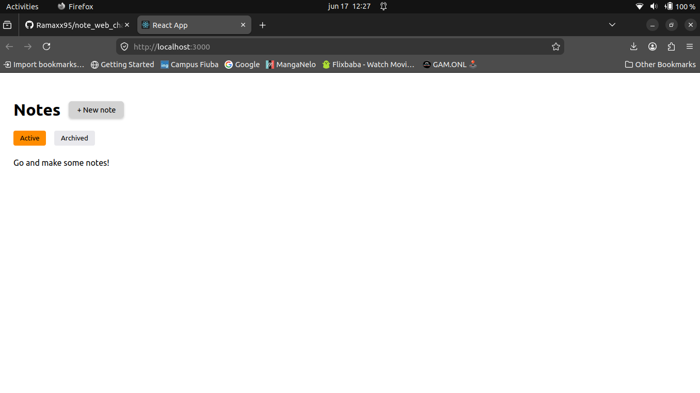
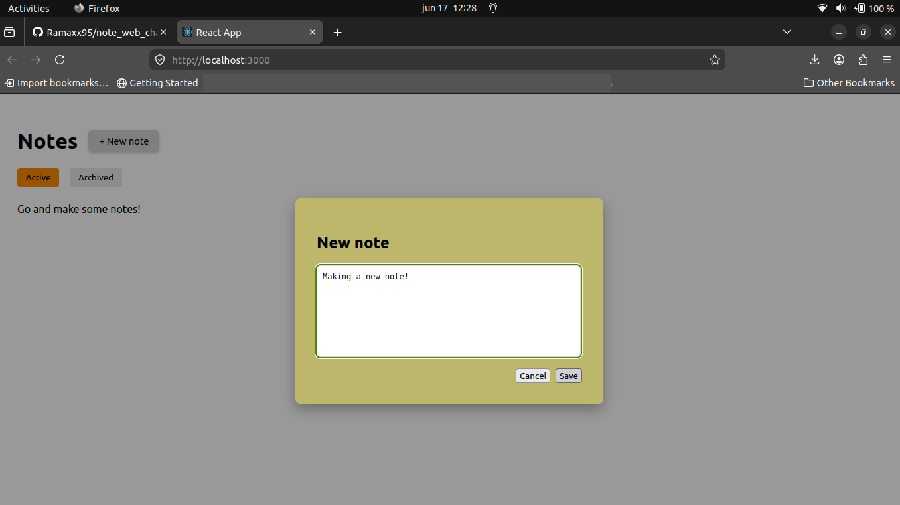
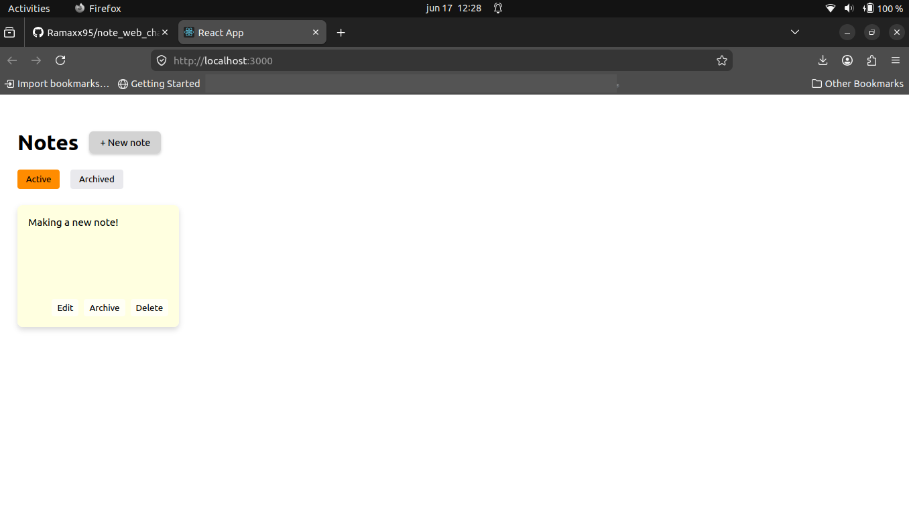
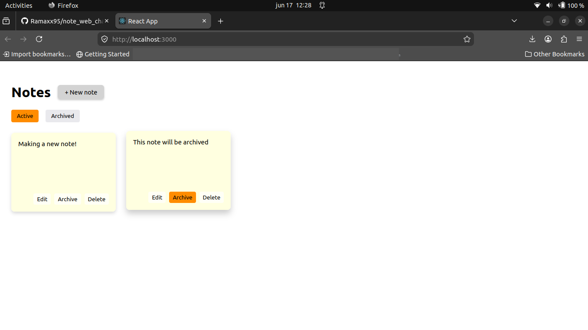
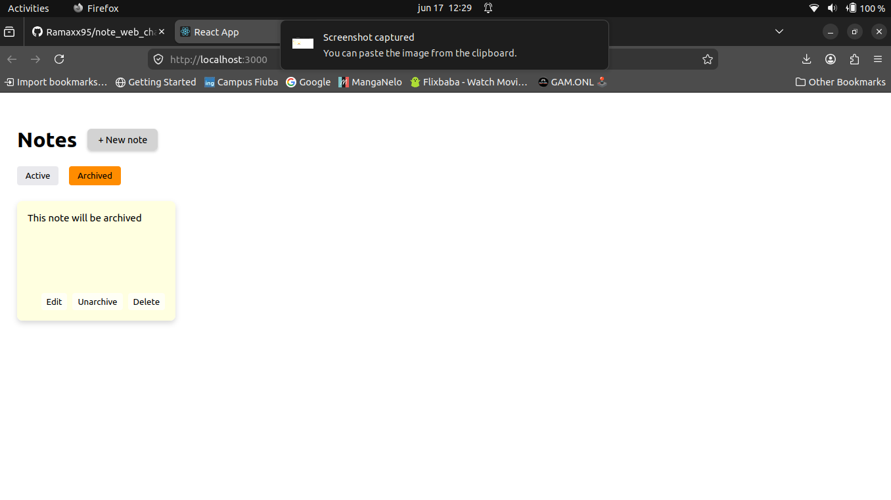

# Note Web

Simple single-web-page that consists of creating, editing and deleting notes. This notes are stored locally in a database and can be categorized as 'archived' or not.

## Instructions

To initialize for the first time, simply run the `setup.sh`, this will configure and start up the database and compilation of the app.
For consecuent runs, you can simply run the `run.sh` script.
Remember to give permissions to both files so you can run them (sudo chmod +x "file_name").

To end the program, simply type ___Ctrl + C___ on your open terminal (As **npm** might still be running, look its PID with **ps** and kill it with the command **kill -9 [PID]**)

## Tools used

* Java JDK 21
* mysql-client-core-8.0
*	mysql-server
*	spring-boot 3.2.1
*	gradle 8.6
*	create-react-app 5.1.0
*	npm 10.8.2
*	nodejs 20.20.0

## Screenshots
* Main page
  
  

* Creating a note (part 1)
  
  

* Creating a note (part 2)

  

* New note created

  

* Archiving a note

  

* Archives

  
